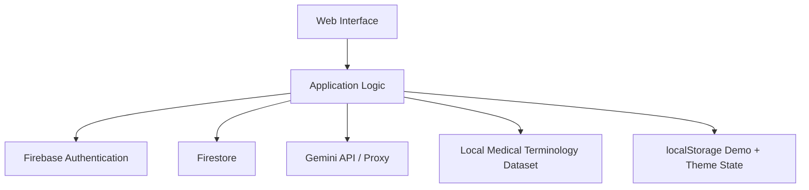

# MedTerm MicroLearn

**AI-Powered Medical English Microlearning**

A lightweight university research prototype demonstrating the concept:

> **“Formation of professional English terminological competence among medical students based on microlearning technology.”**

The original LatinMed/LatinaMed chat assistant has been transformed into a complete educational microlearning flow: authentication, dashboard, five-term lessons, active recall, contextual practice, immediate feedback, adaptive review, progress tracking, streaks, and an AI Medical English Terminology Tutor.

## 1. Project overview

MedTerm MicroLearn is an educational tool for medical, healthcare, and other students learning professional English terminology.

It is **not** a diagnostic or treatment system.

The prototype intentionally keeps the architecture simple: static HTML/CSS/JavaScript, Firebase Authentication/Firestore when configured, a local terminology dataset, and optional Gemini integration.

## 2. Features

- Firebase email/password authentication
- Persistent authenticated sessions
- Demo mode when Firebase is not configured
- Dashboard with daily micro-lesson and learning statistics
- 50+ starter medical English terms across multiple topics
- Five-term micro-lessons
- Term cards with pronunciation, concise definition, Uzbek meaning, medical context, and related terms
- Multiple-choice retrieval practice
- Contextual fill-in-the-blank question
- Immediate correct/incorrect feedback
- Lesson score and session summary
- Weak-term tracking
- Recommended review
- Calendar-day learning streak
- Progress page with topic performance and recent sessions
- AI Medical English Terminology Tutor
- Optional AI-generated micro-lessons
- Gemini failure fallback to the local dataset
- Light/dark themes persisted with localStorage
- Responsive desktop/tablet/mobile layouts
- Accessible labels, focus states, semantic controls, and keyboard-friendly forms
- Medical education safety boundary
- Loading/error states for asynchronous AI/auth/persistence operations

## 3. Microlearning methodology

The application demonstrates:

### Micro-content
Each lesson focuses on approximately five terms and is designed for about five minutes.

### Active recall
The learner must retrieve the meaning of terms after seeing the learning card rather than only rereading content.

### Immediate feedback
Each quiz answer produces immediate feedback and reinforces the correct meaning.

### Contextual practice
The final quiz item uses a medical sentence with a missing term.

### Adaptive review
Incorrect terms are stored as weak terms. Repeated misses increase their review priority.

### Spaced review
The dashboard recommends weak terms for a later session. The prototype uses simple performance-based review rather than a complex scheduling algorithm.

### Personalization
Progress, accuracy, streak, weak terms, preferred difficulty, and recent sessions are persisted.

## 4. Architecture



## 5. Tech stack

- HTML5
- CSS3
- Vanilla JavaScript
- Firebase Authentication
- Firebase Firestore
- Google Gemini API
- Browser localStorage for demo-mode progress/theme state

No build step is required.

## 6. Project structure

```text
MedTerm-MicroLearn/
├── README.md
├── config.js
├── index.html
├── css/
│   └── styles.css
├── data/
│   └── medical-terms.js
└── js/
    ├── app.js
    ├── auth.js
    ├── firebase.js
    ├── gemini.js
    ├── learning.js
    └── ui.js
```

## 7. Installation

1. Download/clone the repository.
2. Open `config.js`.
3. For an immediate UI/learning demonstration, leave credentials empty. The application automatically uses Demo Mode.
4. Serve the directory from a local static server for the most reliable browser behavior, for example VS Code Live Server.
5. Open `index.html`.

No npm install is required.

## 8. Firebase setup

Create a Firebase project and a Web App.

Enable:

- Authentication → Sign-in method → Email/Password
- Firestore Database

Copy the Web App configuration into `config.js`.

The app creates:

```text
users/{uid}
users/{uid}/sessions/{sessionId}
```

The user document stores only learning/profile data needed by the prototype:

```text
displayName
email
createdAt
totalTermsLearned
totalQuizzesCompleted
averageScore
currentStreak
lastLearningDate
preferredDifficulty
weakTerms
```

A session stores:

```text
topic
startedAt
completedAt
termsStudied
questionsAnswered
correctAnswers
score
weakTerms
completed
```

### Suggested Firestore rules

For a prototype, restrict users to their own document and subcollection:

```text
match /users/{userId} {
  allow read, write: if request.auth != null && request.auth.uid == userId;
  match /sessions/{sessionId} {
    allow read, write: if request.auth != null && request.auth.uid == userId;
  }
}
```

Review and adapt security rules before production deployment.

## 9. Gemini setup

The current default is configurable in `config.js`:

```js
window.GEMINI_MODEL = "gemini-3.8-flash";
```

Google's current Gemini API documentation lists Gemini 3.8 Flash as a current stable 3.x model. If model availability changes, edit this single value.

Two integration modes are supported:

### Preferred: server-side proxy

```js
window.PROXY_URL = "https://your-proxy.example.com";
window.GEMINI_API_KEY = "";
```

The proxy should keep the Gemini secret on the server and forward only the required request.

### Prototype/local mode

```js
window.PROXY_URL = "";
window.GEMINI_API_KEY = "YOUR_KEY";
```

This exposes the key in the browser and should only be used for controlled prototypes/testing.

If Gemini is unavailable or not configured:

- built-in lessons still work
- quizzes still work
- progress still works
- the AI Tutor displays a friendly fallback
- AI-generated lesson requests fall back to local terms

## 10. Security warning

The browser-key approach is intentionally supported only for the fastest prototype path. A real Gemini API key embedded in JavaScript can be extracted by users.

For production, use a backend/serverless proxy with:

- server-side secret storage
- authentication/authorization
- rate limiting
- abuse controls
- request validation
- logging/monitoring

Do not commit real API keys to Git.

Firebase Web configuration is not itself a secret, but Firestore security rules must enforce per-user access.

## 11. Deployment

Because this is a static application, it can be deployed to:

- Firebase Hosting
- GitHub Pages
- Netlify
- Vercel static hosting
- another static web host

For production Gemini usage, pair the static frontend with a serverless/backend proxy.

## 12. Educational limitations

This is a research/educational prototype, not a validated medical education product.

- The starter terminology dataset is a curated prototype dataset, not a complete medical dictionary.
- Review scheduling is lightweight rather than a full spaced-repetition algorithm.
- Topic performance visualization is intentionally simple.
- AI output can contain errors and must not be treated as authoritative medical advice.
- Uzbek translations are learning aids and should be reviewed by qualified educators before formal curriculum use.
- The prototype does not collect validated learning-outcome measurements.
- A production research deployment would require formal educational evaluation, privacy review, and appropriate institutional approvals.

## 13. Testing checklist

The intended end-to-end path is:

```text
Open application
→ Register/login or Demo Mode
→ Dashboard
→ Start lesson
→ Learn five terms
→ Retrieval quiz
→ Immediate feedback
→ Lesson result
→ Progress saved
→ Refresh
→ Progress remains
→ AI Tutor
→ Ask terminology question
→ Logout/login
→ Persistent data remains when Firebase is configured
```

Also verify:

- invalid authentication
- empty form input
- Gemini unavailable
- Firebase unavailable
- mobile layout
- dark mode
- refresh while authenticated
- weak-term recommendations
- repeated lessons on one calendar day do not increment the streak more than once

## 14. Research concept mapping

| Research concept | Application evidence |
|---|---|
| Microlearning | Five-term, short sessions |
| Terminological competence | English medical term cards and contextual usage |
| Active recall | Retrieval quiz |
| Immediate feedback | Per-answer feedback |
| Contextual learning | Medical sentence exercise |
| Personalization | Difficulty preference + weak terms |
| Spaced review | Review recommendations |
| AI tutoring | Gemini terminology tutor |
| Progress tracking | Firestore/local progress |
| Motivation | Streak + completion statistics |

## 15. License / academic use

Adapt the license and attribution policy to the original repository and the university/research requirements before public distribution.
